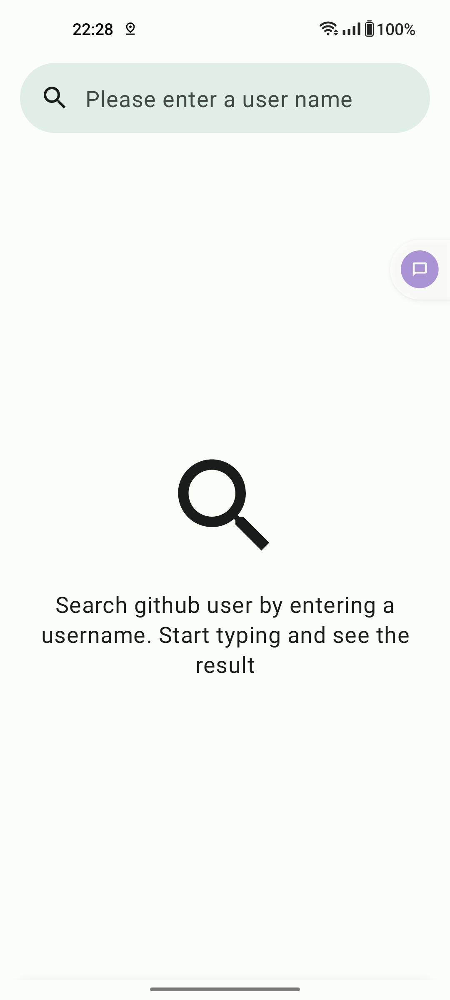
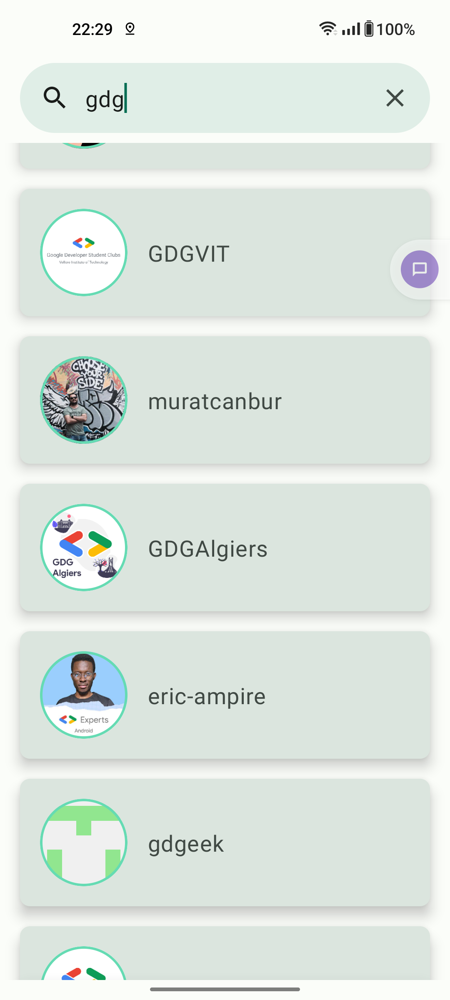
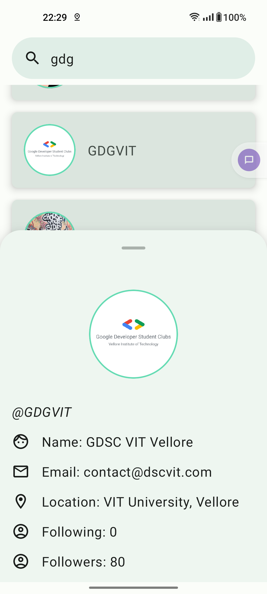
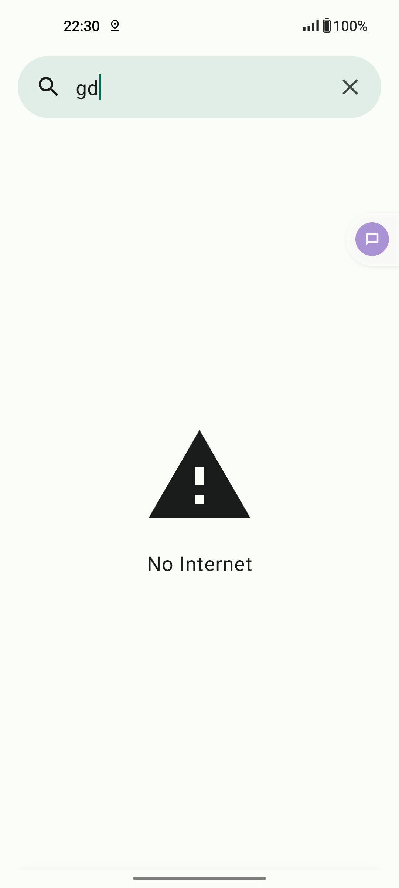
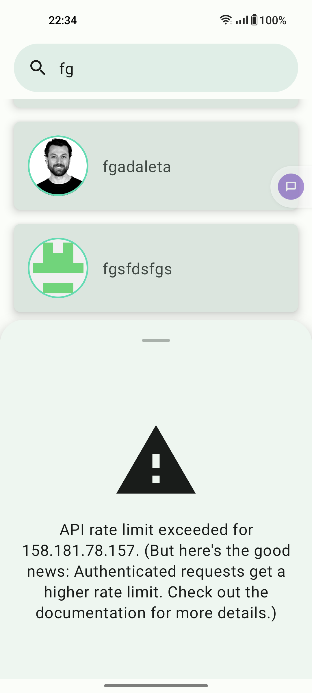

Github Search
===========================
This is a simple Android application that allows users to search for GitHub users using the [GitHub REST API](https://docs.github.com/en/rest/search/search?apiVersion=2022-11-28#search-users). It provides a user-friendly interface and features to explore GitHub profiles.

## Feature List
The app displays a list of user and details information from rest api.

- **Hint Screen**: The app starts with a hint screen to guide users on how to use the search feature.

- **Search Functionality**: Users can initiate a search by tapping on the "Search Input Field" in the top bar, which opens the keyboard and focuses the search box.

- **Search Autocompletion**: As users type keywords, the app waits for 1 second (debouncing) before automatically initiating the search, allowing users to refine their query.

- **Search Results**: The app communicates with the GitHub REST API to fetch a list of GitHub users matching the search query. The search results are displayed in a list format, showing user username and image.

- **User Details**: Clicking on a search result opens a new bottom sheet that displays a larger size image of the selected user along with basic information, providing a detailed view of the user's profile.

- **Day/Night Mode**: Support day and night mode

## Screenshots
Landing page | Search Result  | Details page
--- | ----------------------| ---  
 |   | 

Empty Page - No Result  | Error Page                                             |  Dark mode
--- |--------------------------------------------------------| ---  
 |  | 

## Project Structure
This project follows a multi-module architecture, consisting of the following modules:
- **App**: The main Android application module that includes the user interface and navigation, which can integrate various feature module.

- **Core**: The core module that houses central dependencies and common implementations used across the project.

- **Network**: The network module containing classes and components for making API calls.

- **Search**: The main feature module responsible for the search and user details functionality.

- **BuildSrc**: The build source module that manages project-level dependencies.

Each module has clean architecture that separates concerns and promotes maintainability.

- **Data Layer (data):** This layer is responsible for data retrieval and manipulation. It interacts with external data sources, such as the GitHub REST API, and provides a clean API to the domain layer. Key packages and components include:
    - **Repository:** Manages data sources, caches, and data mapping.
    - **Data Models:** Defines the structure of data entities coming from outer source.

- **Domain Layer (domain):** This layer contains the business logic and use cases of the application. 
    - **Use Cases:** Contains high-level application-specific use cases.
    - **Repositories:** Specifies the data contract required by use cases.
    - **Data Models:** Defines the structure of domain data entities.

- **Presentation Layer (presentation):** This layer handles the user interface and user interaction. It communicates with the domain layer to retrieve data and execute use cases. Key packages and components include:
    - **UI Components:** Contains Compose, activities, fragments, and views.
    - **View Models:** Manages UI-related data and state.

#### Technical Specification Highlight
* MVVM with clean architecture pattern
* Coroutine, Flow, Jetpack Compose
* Paging 3 with Lazy Column - show/hide top/bottom loading animation
* Multi-Module
* Unit/UI test code
* Version catalog
* Android new splash screen api
* Ktlint with pre commit gitHook

## Libraries Used
*[Architecture component][0] - A collection of libraries that help to design robust, testable, and   maintainable apps. Start with classes for managing your UI component lifecycle and handling data persistence.
* [Splash Screen][5] -  API lets apps launch with animation, including an into-app motion at launch.
* [Ktx][7] - Provide concise, idiomatic Kotlin code
* [Coroutines][13] a concurrency design pattern that you can use on Android to simplify code that executes asynchronously.
* [Jetpack Compose][8] - Android’s recommended modern toolkit for building native UI.
* [Version Catalog][1] - enable you to add and maintain dependencies and plugins in a scalable way.
* [Paging][23] - helps you load and display pages of data from a larger dataset from local storage or over network

#####  Third party
* [HILT][10] for dependency injection and to abstract away boiler-plate code.
* [Coil][12] image loading library for Android backed by Kotlin Coroutines.
* [Retrofit][14] A strongly-typed, caching REST client for Android.
* [Moshi][20] serialization/deserialization library to convert Java/Kotlin Objects into JSON and back.
#####  UI and Unit Test
* [Junit][15] unit testing framework.
* [AssertJ][16] allows you to write assertions.
* [Mockito][17] mocking framework.
* [Espresso][18] Ui test framework.
* [Truth][21]  fluent assertions for Java and Android

[0]: https://developer.android.com/jetpack/components
[1]: https://docs.gradle.org/current/userguide/platforms.html
[5]: https://developer.android.com/develop/ui/views/launch/splash-screen
[6]: https://developer.android.com/topic/libraries/architecture/viewmodel
[7]: https://developer.android.com/kotlin/ktx

[8]: https://developer.android.com/jetpack/compose
[9]: https://developer.android.com/guide/topics/ui/declaring-layout

[10]: https://dagger.dev/hilt/
[11]:https://developers.google.com/maps/documentation/android-sdk/start
[12]:https://coil-kt.github.io/coil/
[13]:https://developer.android.com/kotlin/coroutines
[14]:https://square.github.io/retrofit/
[15]:https://junit.org/junit4/
[16]:https://joel-costigliola.github.io/assertj/
[17]:https://site.mockito.org/
[18]:https://developer.android.com/training/testing/espresso#packages
[18]:https://junit.org/junit4/
[20]:https://github.com/square/moshi
[21]:https://truth.dev/
[22]:https://developer.android.com/guide/navigation/navigation-getting-started
[23]:https://developer.android.com/topic/libraries/architecture/paging/v3-overview
   

